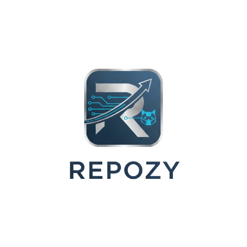

  

## 🌟 Overview

Repozy is an innovative SaaS platform designed to revolutionize the way developers interact with their GitHub repositories. Leveraging the power of AI, Repozy provides deep code insights, streamlines project data management, enhances team collaboration, and offers flexible monetization options for premium features. Our goal is to be the intelligent assistant for every developer workflow, making your code smarter and your development process more efficient.

## ✨ Features

- **AI-Powered Code Insights**
  - Get instant feedback, automated documentation, and intelligent suggestions using the Gemini AI API.
  - Analyze commit history, pull requests (PRs), and issues effortlessly.
- **Smart Repository Management**
  - Seamlessly integrate with GitHub to fetch and synchronize repository data.
  - Store and manage relevant project data efficiently in NeonDB.
- **Enhanced Developer Collaboration**
  - Schedule and manage team meetings using Firebase.
  - Automatically transcribe meeting audio to text with AssemblyAI for easy reference and knowledge sharing.
- **Subscription-Based Monetization**
  - Access premium AI features and advanced functionalities through flexible subscription plans.
  - Secure payment processing via Cashfree and PayPal Payments.
- **Seamless Deployment & Scaling**
  - Hosted and managed on Vercel, ensuring a smooth, high-performance, and scalable user experience.

## 🚀 Getting Started

To get started with Repozy:

1.  **Sign Up/Login:** Access the platform via secure User Authentication powered by Clerk.
2.  **Connect GitHub:** Integrate your GitHub account from the dashboard to import your repositories.
3.  **Explore Insights:** Let our AI analyze your code and provide valuable insights directly within your dashboard.
4.  **Collaborate:** Utilize Firebase for scheduling meetings and AssemblyAI for transcription services.
5.  **Unlock Premium:** Explore our subscription plans for advanced AI capabilities and features.

## 🛠️ Technology Stack

Repozy is built with a robust and modern technology stack:

- **Frontend:**  Next.js
- **Backend:** Node.js
- **User Authentication:** Clerk
- **AI Integration:** Gemini AI API
- **Database:** NeonDB (PostgreSQL)
- **Meeting & Collaboration:** Firebase
- **Transcription:** AssemblyAI
- **Payments:** Cashfree + PayPal
- **Deployment & Hosting:** Vercel

## 📈 Funding & Growth Plan

With dedicated funding, Repozy aims to:

- **Diversify AI Insight Sources:** Expand beyond the Gemini AI API to integrate and leverage multiple advanced AI models for richer, more varied code and project analysis.
- **Introduce Custom Project Automation:** Develop specialized workflows to automate common tasks related to project data syncing, insight generation, and team collaboration within the platform.
- **Scale Marketing & User Acquisition:** Launch targeted campaigns to reach engineering teams, professional GitHub users, and companies seeking to integrate AI into their project management and code review processes.

## 🎯 Market Potential

With over 100 million developers on GitHub and the accelerating adoption of AI in software development, Repozy is strategically positioned to capture a significant share of the multi-billion-dollar DevOps and developer tools market. We cater to a wide audience including individual developers, startups, engineering teams, and enterprises looking for an AI-driven assistant to optimize their development lifecycle.

## 🤝 Contribution

We welcome contributions from the community! If you're interested in contributing to Repozy, please email me to [mohamedkamran04@gmail.com].

## 📄 License

This project is licensed under the [MIT License](LICENSE) - see the [LICENSE](LICENSE) file for details. 

---
